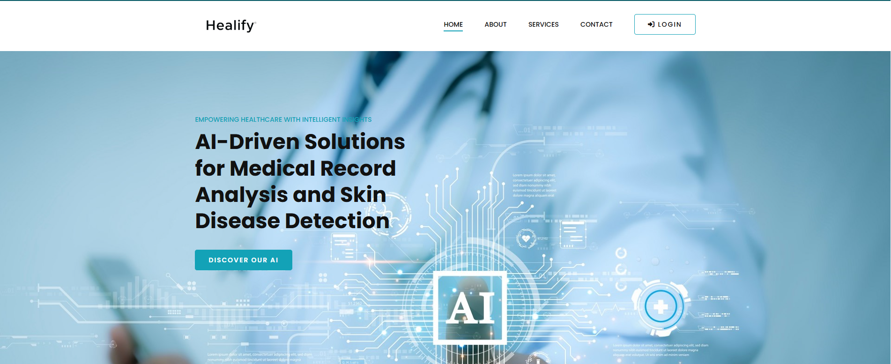
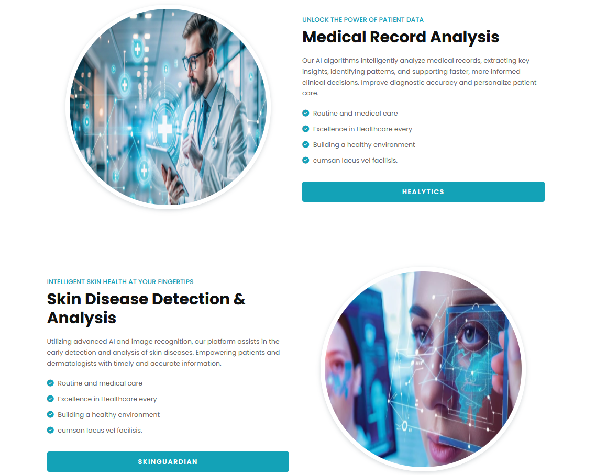

# 🩺 Healify: AI-Powered Healthcare Companion

**Healify** is an AI-powered platform designed to simplify complex medical reports and provide accessible healthcare insights for patients. By leveraging advanced AI technologies, Healify empowers users with clear, personalized health information through report analysis, a medical chatbot, and a skin disease detection tool.

---

## ✨ Features

Healify integrates four key AI-driven functionalities:

### 🧠 Healytics (AI-Powered Medical Report Analysis)
- **Goal:** Simplifies medical reports into easy-to-understand summaries for non-experts.
- **Technology:** Fine-tuned LLM (`meta-llama/Llama-3.2-1B-Instruct`) using LoRA for efficient training.
- **Data Strategy:** Synthetic data generated from structured MIMIC-III (de-identified) records to address real medical data scarcity.
- **Process:** Extracts text from uploaded PDFs and provides a simplified interpretation using the fine-tuned LLM.

---

### 💬 HealyChat (RAG-Powered Medical Q&A)
- **Goal:** Provides accurate, up-to-date answers to medical questions based on patient records.
- **Technology:** Retrieval Augmented Generation (RAG).
- **Benefits:** Reduces hallucinations, retrieves relevant information from uploaded documents, and ensures domain-specific expertise.

---

### 📷 SkinGuard (AI-Driven Skin Disease Detection)
- **Goal:** Automatically classifies skin lesions from images to assist in early diagnosis.
- **Technology:** Custom Convolutional Neural Network (CNN).
- **Performance:** 84% accuracy in classifying 5 common skin diseases:
  - Basal Cell Carcinoma
  - Dermatofibroma
  - Melanoma
  - Nevus
  - Vascular Lesions
- **Usage:** Assists clinical diagnosis, triage, and education.

---

### 👩‍⚕️ Medical Assistant (DeepSeek Integration)
- **Goal:** Interactive virtual medical assistant for general health inquiries.
- **Technology:** DeepSeek LLM.
- **Functionality:** Answers general medical questions and offers details about diseases detected by SkinGuard (e.g., causes, treatments).

---

## 📂 Dataset & Fine-Tuning Notebook

### 🔗 Hugging Face Dataset

The synthetic dataset used for training Healytics (medical report simplification) is available on my official Hugging Face Hub:

👉 **[Healify Synthetic Medical Notes](https://huggingface.co/datasets/Ihssane123/Synthetic_Medical_Notes)**  
*(Generated from structured MIMIC-III records all the processing informations and notebooks links can be found the dataset card)*

---

### 📓 Fine-Tuning Notebook

The notebook used to fine-tune the `Llama-3.2-1B-Instruct` model via LoRA is available here:

👉 **[Healify Fine-Tuning Notebook on Kaggle](https://www.kaggle.com/code/ihssanened/llama-3-2-1b-instruct-medical-ipynb)**  
*(Includes synthetic data loading, preprocessing, LoRA config, training loop, and evaluation)*

---

For more technical details you can check the included report.


## 🧰 Tech Stack

- **Frontend:** Html, Css, Js. 
- **Backend:** Django  
- **AI/ML:** Llama-3.2-1B-Instruct (fine-tuned), DeepSeek, Custom CNN  
- **Data:** Synthetic generation, MIMIC-III, Hugging Face datasets

---

---

## 📽 Demo & Preview

### 🖼️ UI Preview

Below is a snapshot of the Healify interface showcasing the **Home Page** and **Services Dashboard**:

<p align="center">
  
</p>

<p align="center">
  
</p>

> *Images include: AI report upload, chatbot, skin disease detection, and medical assistant features.*

---

### 🎬 Live Demo Video

Watch our walkthrough video demonstrating Healify in action:  
🔗 [Watch the demo on LinkedIn](https://www.linkedin.com/posts/asmae-ajgagal-07bb3a341_ai-healthcareai-llm-ugcPost-7345528723535790082--4gA?utm_source=share&utm_medium=member_desktop&rcm=ACoAADvWcXoBTmC08wesSZVxMJTL5RihNNp0lyY)

---

### 🎨 Canva Presentation (Project Overview & Design)

Explore our **project** via Canva:

📎 [Open Canva Presentation](https://www.canva.com/design/DAGptZ4ijtA/XHMATOWqoJQhHdVYWSb91Q/view?utm_content=DAGptZ4ijtA&utm_campaign=designshare&utm_medium=link2&utm_source=uniquelinks&utlId=h1f94237ba1)


 ---

## ⚙️ Getting Started

Follow these steps to run Healify locally:

### 1. Clone the repository

```bash
git clone https://github.com/Ihssane5/Healify
cd healify
```

### 2. Create a virtual environment 
```bash
conda env create -f env.yml
```
### 3. Activate the virtual environment
```bash
conda activate heal 
```
### 4. Run the application
```bash
python manage.py runserver 
```
### 5. Finally

Navigate to the provided link


🤝 Contributing
Contributions are welcome! Please fork the repository and submit a pull request.

📄 License
This project is licensed under the MIT License. See the LICENSE file for details.

✉️ Contact
NEDJAOUI Ihssane
📧 ihssanenedjaoui5@gmail.com
